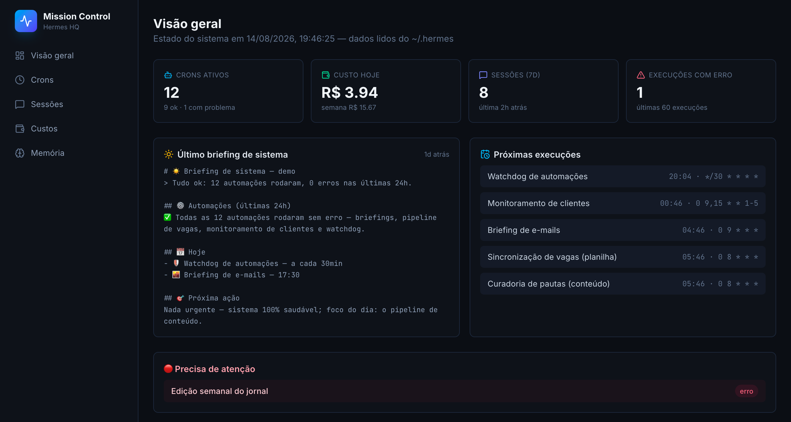

# Mission Control — Hermes HQ

> **🌎 English version: [README.en.md](README.en.md) / [English README](README.en.md)**

Dashboard local (Next.js 16) que mostra o estado do Hermes Agent do Jp em tempo real, lendo direto do `~/.hermes` — sem banco externo, sem API, sem deploy.

> ⚠️ Projeto em `~/mission-control` (fora do Desktop) porque o macOS TCC bloqueia processos launchd de acessar `~/Desktop` — o LaunchAgent `com.mission-control.server` sobe o servidor com o Mac. Há um symlink em `~/Desktop/projetos/mission-control` apontando pra cá.

## 🚀 Demo ao vivo (Vercel)

**[mission-control-mauve-six.vercel.app](https://mission-control-mauve-six.vercel.app)** — deploy público com **dataset demo sanitizado** (sem dados pessoais). Ideal para portfólio/recrutadores.



## O que mostra

| Página | Conteúdo |
|---|---|
| `/` | Visão geral: crons ativos/ok/erro, custo hoje/semana/mês, sessões recentes, último briefing ☀️, próximas execuções, alertas |
| `/crons` | Tabela dos jobs + histórico de execuções com contador de erros |
| `/sessoes` | Sessões do perfil carreira: fonte, custo estimado, tokens, modelo |
| `/custos` | Gráfico de custo por dia (14 dias) + consumo por cron com barras |
| `/memoria` | Editor de MEMORY.md e USER.md (salva direto no perfil) |

## Para recrutadores — o que este projeto demonstra

1. **Observabilidade de agentes de IA**: camada de controle (crons, falhas, custos, memória) ao redor de um sistema de agentes autônomo — o "mission control" que falta na maioria dos setups.
2. **Next.js 16 + App Router + Tailwind 4 + Recharts + lucide-react**: dashboard moderno, server components, gráficos interativos.
3. **SQLite nativo sem dependências**: leitura direta de bancos e arquivos via `node:sqlite` (Node 22) — zero deps de compilação, arquitetura enxuta.
4. **Arquitetura de demo segura**: mesmo código roda com dados reais (local) ou dataset sanitizado (Vercel) via `DEMO_MODE` — dados pessoais nunca vazam.
5. **Automação real**: o dashboard monitora um agente que roda 13 cron jobs de verdade (briefings, pipeline de vagas, curadoria de conteúdo) — não é um projeto fictício.

**Stack**: Next.js 16.3 · React 19 · Tailwind 4 · Recharts · lucide-react · node:sqlite

## Fontes de dados (tudo local, read-only exceto memória)

- `~/.hermes/cron/jobs.json` — definições/status dos crons
- `~/.hermes/cron/executions.db` — histórico de execuções (SQLite)
- `~/.hermes/profiles/carreira/state.db` — sessões, custos, tokens (SQLite)
- `~/.hermes/cron/usage_audit.jsonl` — consumo por job
- `~/.hermes/profiles/carreira/memories/MEMORY.md` + `USER.md` — memória (editável)

## Rodar

```bash
npm install
npm run dev        # http://localhost:3020 (dados reais do ~/.hermes)
DEMO_MODE=1 npm run dev   # dataset demo sanitizado
npm run build      # valida produção
npm run start      # produção na 3020
```

## Deploy na Vercel

- Conecte o repo no Vercel (Git integration) — **zero env vars necessárias**
- Sem `~/.hermes` no ambiente, o app entra em **modo demo automaticamente**
- Todo `git push` na `main` redeploya

## Notas

- Custo é **estimativa**: USD × 5,4 (aproximação de conversão).
- O dashboard lê o perfil `carreira` (`~/.hermes/profiles/carreira/`).
- Sem autenticação — **só rode em máquina local / rede confiável**.
- `NEXT_TELEMETRY_DISABLED=1` no `.env.local` (evita hang do build).
